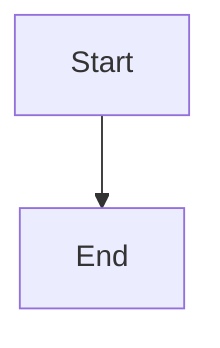

# Documentation

This page documents the documentation site structure and implementation.

## Project Structure

The documentation project lives in the `docs/` directory on the `docs` branch:

```
docs/
├── docs/                   # Documentation content
│   ├── index.md           # Landing page
│   ├── usage/
│   │   └── index.md       # End-user documentation
│   ├── development/
│   │   └── index.md       # Developer workflows
│   └── code-base/
│       ├── index.md       # Code-base intro
│       ├── dojo.md        # Main project docs
│       └── documentation.md # This file
├── site/                   # Built documentation (generated)
├── mkdocs.yml             # MkDocs configuration
├── pyproject.toml         # Documentation dependencies
├── uv.lock                # Locked dependency versions
├── .pre-commit-config.yaml # Pre-commit hooks
└── .python-version        # Python version specification

```

## Documentation Framework

This site is built with
[Material for MkDocs](https://squidfunk.github.io/mkdocs-material/), a static
site generator based on MkDocs with a Material Design theme.

### Key Dependencies

From `pyproject.toml`:

- **mkdocs**: Static site generator
- **mkdocs-material**: Material Design theme
- **mkdocstrings[python]**: API documentation generator for Python code

### MkDocs Configuration

The `mkdocs.yml` file configures:

- **Site metadata**: Name, description, author
- **Theme settings**: Material theme with light/dark mode toggle
- **Navigation**: Site structure and menu
- **Plugins**: Search and mkdocstrings for API docs
- **Markdown extensions**: Code highlighting, admonitions, tabbed content,
  Mermaid diagrams

Key features enabled:

- Navigation tabs and sections
- Search with suggestions and highlighting
- Code block copying and annotations
- Mermaid diagram support
- Strict mode (fails build on warnings)

## Documentation Conventions

This documentation follows the
[standard Mekara documentation conventions](https://github.com/Meksys/mek/tree/main/project-scaffold-script/docs/docs/code-base/documentation/standard-mekara-docs.md),
which organizes content into:

### `usage/`

End-user documentation: installation, CLI usage, and user-facing features.

**Update when:** You change how users interact with the product (new commands,
changed flags, output format changes).

### `development/`

Development workflows and processes for both human and AI agents. Includes build
commands, test commands, development workflows, and how to run things.

**Update when:** You change build commands, add new dev tools, modify CI/CD, or
update development conventions.

### `code-base/`

Navigation guide to the codebase as a static entity: implementation details,
gotchas, and architecture for re-implementors. Explains what exists, how it's
structured, and why certain decisions were made.

**Update when:** You add new modules, change architecture, or discover important
implementation details that future maintainers need to know.

## Building the Documentation

### Local Development

To build and serve the documentation locally:

```bash
cd docs/  # Navigate to docs worktree
uv run mkdocs serve
```

The site will be available at `http://127.0.0.1:8000/`.

### Production Build

To build the static site for deployment:

```bash
cd docs/
uv run mkdocs build --strict
```

This generates the static site in the `site/` directory. The `--strict` flag
ensures the build fails on any warnings.

## Navigation Structure

The site navigation is defined in `mkdocs.yml`:

```yaml
nav:
  - Home: index.md
  - Usage:
      - usage/index.md
  - Development:
      - development/index.md
  - Code-base:
      - code-base/index.md
      - code-base/dojo.md
      - code-base/documentation.md
```

MkDocs automatically generates section titles from the first heading in each
file.

## Markdown Extensions

The documentation supports several extended Markdown features:

### Code Blocks

Syntax highlighting with line numbers and copy buttons:

````markdown
```python
def hello():
    print("Hello, world!")
```
````

### Admonitions

Callout boxes for notes, warnings, etc.:

```markdown
!!! note
    This is a note admonition.

!!! warning
    This is a warning admonition.
```

### Mermaid Diagrams

Flowcharts and diagrams using Mermaid:

````markdown

````

**Important:** Always use `flowchart TD` (top-down) or `flowchart TB`
(top-bottom) for flowcharts, never `LR` (left-right), as horizontal flows don't
work well on mobile devices.

### Tabbed Content

```markdown
=== "Tab 1"
    Content for tab 1

=== "Tab 2"
    Content for tab 2
```

## Maintenance

### Adding New Pages

1. Create a new `.md` file in the appropriate section (`usage/`, `development/`,
   or `code-base/`)
1. Add the file to the `nav:` section in `mkdocs.yml`
1. Update the parent section's `index.md` to link to the new page
1. Test the build with `uv run mkdocs build --strict`

### File Naming

- Use kebab-case for all file and directory names (e.g., `build-and-test.md`)
- Name files using the kebab-cased version of their sidebar title
- Every folder should have an `index.md` that serves as the section introduction

### Links

- Use relative links to reference other documentation pages
- Link to `index.md` explicitly, not just the directory
- Good: `[Development](../development/index.md)`
- Bad: `[Development](../development/)`

## Pre-commit Hooks

The documentation project has pre-commit hooks configured:

- **Trailing whitespace**: Removes trailing whitespace
- **End of file fixer**: Ensures files end with a newline
- **YAML check**: Validates YAML files
- **Large files check**: Prevents committing large files

These run automatically on commit to maintain documentation quality.
