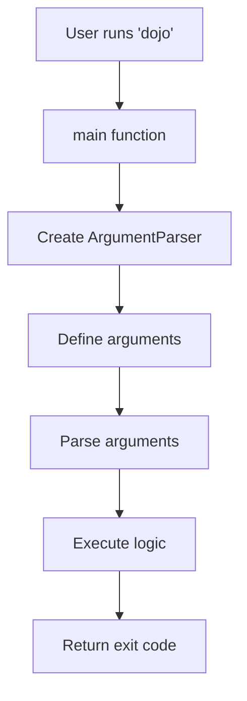

# Dojo

This page documents the main Python CLI project structure and implementation.

## Project Structure

The main project lives in the `python/` directory on the `main` branch:

```
python/
├── src/
│   └── dojo/
│       ├── __init__.py    # Package initialization and version
│       └── cli.py         # CLI entry point
├── tests/
│   └── test_sanity.py     # Test suite
├── .github/
│   └── workflows/         # CI configuration
├── pyproject.toml         # Project metadata and dependencies
├── uv.lock                # Locked dependency versions
├── .pre-commit-config.yaml # Pre-commit hook configuration
├── .python-version        # Python version specification
├── README.md              # User-facing README
└── AGENTS.md              # AI agent guidance
```

## Core Modules

### `src/dojo/__init__.py`

Package initialization file that exports the version number:

- `__version__`: String containing the current version (e.g., `"0.1.0"`)

The version is defined here to maintain a single source of truth for the package
version.

### `src/dojo/cli.py`

Main CLI entry point using argparse:

- `main()`: Main entry point that parses arguments and executes the CLI
  - Returns: Exit code (0 for success)
  - Currently prints "Hello from dojo!" when run without arguments

The CLI is minimal by design, serving as a scaffold for future functionality.

## Architecture

### CLI Implementation

Dojo uses Python's built-in `argparse` module for command-line argument parsing.
The architecture is intentionally simple:



1. `main()` function creates an `ArgumentParser`
1. Defines available arguments and options
1. Parses command-line arguments
1. Executes the appropriate logic (currently just prints a message)
1. Returns an exit code

### Entry Points

The CLI is exposed via a console script entry point in `pyproject.toml`:

```toml
[project.scripts]
dojo = "dojo.cli:main"
```

This allows users to run `dojo` from the command line after installation.

## Development Tools

### Package Management

The project uses `uv` for dependency management, configured in `pyproject.toml`:

- **Build system**: hatchling
- **Python version**: >=3.12
- **Runtime dependencies**: None currently
- **Dev dependencies**: mypy, pre-commit, pytest, ruff

### Code Quality

Code quality is enforced through pre-commit hooks:

- **ruff format**: Automatic code formatting
- **ruff check**: Linting with auto-fixes applied where possible
- **mypy**: Strict type checking

All checks are defined in `.pre-commit-config.yaml` and run automatically on
commit.

### Testing

Tests are written with pytest and located in the `tests/` directory. The project
uses a simple test structure with no special pytest plugins or configurations.

## Continuous Integration

CI is handled through GitHub Actions with two workflows:

1. **Pre-commit checks** (`.github/workflows/pre-commit.yml`): Runs formatting,
   linting, and type-checking
1. **Tests** (`.github/workflows/tests.yml`): Runs the full test suite

Both workflows run on push and pull request events. All checks must pass before
code can be merged to `main`.

## Project Metadata

Key information from `pyproject.toml`:

- **Name**: dojo
- **Version**: 0.1.0
- **Description**: Dojo - A Python CLI tool
- **Python requirement**: >=3.12
- **Build backend**: hatchling

## Future Considerations

As the project grows, consider documenting:

- Command implementation details
- Configuration file formats (if added)
- Plugin architecture (if implemented)
- Data models and schemas
- Error handling patterns
- Performance considerations
